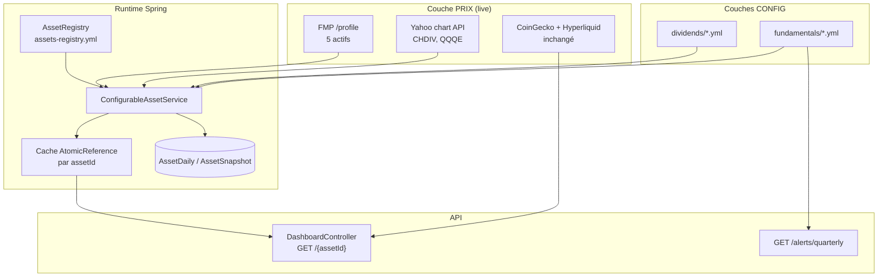

---
stepsCompleted: [1, 2, 3, 4, 5, 6, 7, 8]
inputDocuments:
  - docs/project-context.md
  - _bmad-output/planning-artifacts/prds/prd-Dashboard-2026-06-17/prd.md
  - _bmad-output/planning-artifacts/prds/prd-Dashboard-2026-06-17/addendum.md
  - _bmad-output/planning-artifacts/prds/prd-Dashboard-2026-06-17/.decision-log.md
  - _bmad-output/planning-artifacts/research/spike-scrape-ubs-report-2026-06-17.md
workflowType: architecture
project_name: Dashboard
user_name: Dokk
date: '2026-06-17'
lastStep: 8
status: complete
completedAt: '2026-06-17'
revision: v1-multi-asset-3-layers
---

# Architecture — Extension multi-actifs Dashboard

_Document de décisions techniques pour l'extension brownfield PRD v2.1 (modèle 3 couches : prix live / dividendes config / fondamentaux config). Projet solo hobby — fast path accepté._

---

## 1. Analyse du contexte projet

### 1.1 Exigences fonctionnelles (18 FR)

| Zone | FR | Implication architecture |
|------|-----|--------------------------|
| Cadre générique | FR-1, FR-2, FR-3 | Registre YAML + service unique + persistance `AssetDaily`/`AssetSnapshot` |
| Config métier | FR-4, FR-5, FR-6 | Loaders YAML dividendes/fondamentaux ; calcul yield backend ; alerte trimestrielle |
| Scrape SIX | FR-7 | Provider scrape isolé, parser `yahoo-six-chart`, cache fallback |
| Actifs | FR-8 à FR-13 | Même pipeline ; différences = config YAML + cartes UI optionnelles |
| Migration InveB | FR-14 | Délégation au cadre générique ; suppression constantes front |
| Navigation | FR-15, FR-16 | Template page + routes lazy par `assetId` |
| Sync & ops | FR-17, FR-18 | Crons tierisés ; compteurs appels ; isolation échecs |

### 1.2 NFR transverses

- **Quota FMP** : ~130 appels/j (5 actifs × 15 min, heures marché) — marge sur quota 250.
- **Scrape** : ~96 req/j, heures SIX uniquement, User-Agent identifiable.
- **RAM VPS** : cache `AtomicReference` par actif (pattern InveB existant) — pas de Redis.
- **Pas d'appel provider sur GET HTTP** : lecture cache uniquement côté requête front.
- **HYPE inchangé** : hors registre multi-actifs v1.

### 1.3 Complexité

- **Niveau** : moyen (brownfield, 7 actifs configurables + 1 crypto legacy).
- **Domaine** : full-stack web (Angular 21 + Spring Boot 4).
- **Cross-cutting** : heures marché multi-fuseaux, normalisation symboles BD, observabilité providers, DTO unifié front/back.

### 1.4 État brownfield (contraintes)

```text
AssetSyncJob          → hardcode HypeService + InveBService (cron 10 min unique)
InveBService          → FMPClient, cache AtomicReference, logique marché Stockholm
AssetDaily/Snapshot   → clé symbol "INVE-B" (sans suffixe .ST)
DashboardController   → GET /hype, GET /inveb (pas de route générique)
Front InveB           → INVEB_FUNDAMENTALS_METRICS hardcodé, dividendes constants
FMPClient             → /profile uniquement via ExternalCallExecutor ✓
```

---

## 2. Vue d'ensemble — modèle 3 couches



---

## 3. Décisions architecturales (ADR)

### ADR-01 — Service générique unique, pas de `*Service` × 7

**Contexte** : `InveBService` duplique FMP + cache + historique. PRD FR-1 interdit la copier-coller.

**Décision** : Un seul `ConfigurableAssetService` (nom retenu : explicite sur la config, évite ambiguïté avec « Generic ») gère tous les actifs du registre. Pas de thin wrapper par actif en production.

**Migration InveB** : `InveBService` devient façade temporaire `@Deprecated` qui délègue à `ConfigurableAssetService.get("inveb")` et mappe vers `InveBDto` pour compatibilité tests ; supprimée en fin de migration (FR-14).

**Conséquences** :
- (+) Un seul point de maintenance sync/cache/historique.
- (+) SM-2 : ajout 9ᵉ actif = YAML + route front.
- (−) DTO unique plus riche qu'`InveBDto` actuel — migration types front.

**FR couverts** : FR-1, FR-2, FR-3, FR-14.

---

### ADR-02 — Registre YAML multi-provider (`fmp` | `scrape`)

**Décision** : Fichier `backend/src/main/resources/config/assets-registry.yml` chargé via `@ConfigurationProperties(prefix = "app.assets-registry")`.

Chaque entrée :

```yaml
- id: inveb                    # assetId API + route front
  provider: fmp                # fmp | scrape
  symbol: INVE-B.ST            # symbole provider (FMP ou Yahoo)
  db-symbol: INVE-B            # clé AssetDaily/Snapshot (rétrocompat InveB)
  type: STOCK                  # STOCK | REIT | ETF | TRUST
  currency: SEK
  market-hours:
    zone: Europe/Stockholm
    open: "09:00"
    close: "17:35"
  sync:
    interval-minutes: 15
    offset-minutes: 0          # décalage anti-burst entre actifs FMP
  scrape-parser: yahoo-six-chart  # uniquement si provider=scrape
```

**Conséquences** :
- ISIN en commentaire YAML (D-07) — pas de lookup runtime.
- `AssetRegistry` expose `List<AssetDefinition>` + lookup par `id`.

**FR couverts** : FR-1, FR-7, FR-17.

---

### ADR-03 — Normalisation symbole BD : champ `db-symbol` distinct

**Contexte** : BD actuelle utilise `INVE-B` ; FMP utilise `INVE-B.ST`. Remettre en cause casserait l'historique.

**Décision** : Le registre porte **deux** symboles :
- `symbol` → appel provider (FMP/Yahoo).
- `db-symbol` → clé JPA `AssetDaily.symbol` / `AssetSnapshot.symbol`.

Règle : `db-symbol` = symbole sans suffixe bourse quand possible (`BRWM`, `INVE-B`, `O`, `III`, `INFR`, `CHDIV`, `QQQE`). Pour `O` (Realty Income), conserver `O` tel quel.

**Conséquences** :
- (+) Zéro migration données InveB.
- (+) Graphiques annuels inchangés (FR-3).
- (−) Les développeurs doivent toujours utiliser `db-symbol` pour les requêtes repository.

**FR couverts** : FR-3, FR-14.

---

### ADR-04 — Interface `PriceProvider` + adaptateurs FMP et Scrape

**Décision** :

```java
public interface PriceProvider {
    String providerId();  // "fmp" | "scrape"
    PriceQuote fetch(AssetDefinition asset);
}

public record PriceQuote(
    double price,
    String currency,
    Double marketCap,           // nullable (scrape Yahoo = null)
    Double changePercent24h,    // nullable
    Double volume,              // nullable
    Instant fetchedAt
) {}
```

- `FmpPriceProvider` : wrap `FMPClient.getData(symbol)[0]`.
- `ScrapePriceProvider` : dispatch vers parser selon `scrape-parser` ; seul `yahoo-six-chart` en v1.
- `PriceProviderRegistry` : `Map<String, PriceProvider>` injecté par Spring.

**Conséquences** :
- Pas de factory extensible générique (non-goal PRD) — enum/parser fixe suffit.
- Scrape et FMP partagent `ExternalCallExecutor` (timeout 15 s, retry 2 pour scrape).

**FR couverts** : FR-7, FR-17.

---

### ADR-05 — Parser scrape `YahooSixChartParser`

**Décision** : Client HTTP dédié `YahooChartClient` + parser Jackson.

```
GET https://query1.finance.yahoo.com/v8/finance/chart/{symbol}?interval=1d&range=1d
→ chart.result[0].meta.regularMarketPrice
→ chart.result[0].meta.currency
```

User-Agent : `DashboardBot/1.0 (+https://dashboard.dokkcorp.ch)` (D-18, D-21).

Échec parse → log WARN, retour cache, `priceSource: cache` dans DTO (FR-7).

**FR couverts** : FR-7, FR-18.

---

### ADR-06 — Dividendes et fondamentaux : fichiers YAML séparés

**Décision** :
- `backend/src/main/resources/config/dividends/{assetId}.yml`
- `backend/src/main/resources/config/fundamentals/{assetId}.yml`

Loaders :
- `AssetDividendsConfig` → `Map<String, DividendsConfig>`
- `AssetFundamentalsConfig` → `Map<String, FundamentalsConfig>`

Calcul backend (FR-4) :

```java
estimatedYield = forwardDividend / currentPrice * 100  // BigDecimal, scale 2
```

**Reload config** : **restart Docker** en v1 (ADR-07). Pas d'actuator refresh.

**FR couverts** : FR-4, FR-5, FR-6.

---

### ADR-07 — Reload YAML : restart Docker, pas d'actuator v1

**Contexte** : Open question PRD §8.2.

**Décision** : `@ConfigurationProperties` chargé au démarrage. MAJ config trimestrielle (~4×/an) → `docker compose restart backend` acceptable usage perso.

**Conséquences** :
- (+) Zéro dépendance Spring Cloud / actuator.
- (+) Simplicité ops solo.
- (−) ~30 s d'indisponibilité backend lors MAJ config — acceptable.

**FR couverts** : FR-6.

---

### ADR-08 — Alerte trimestrielle : endpoint dédié + flag inline DTO

**Contexte** : Open question PRD — dédié vs inline.

**Décision** : **Les deux, rôles distincts** :
1. `GET /api/dashboard/alerts/quarterly` → `{ alerts: [{ assetId, label, updatedAt, daysStale }] }` pour le bandeau overview (FR-5) — **un seul appel** overview.
2. Champ `fundamentals.stale: boolean` dans chaque `AssetDto` pour badge page détail.

Seuil : **90 jours fixe** tous types (réponse open question PRD §8.3) — configurable via `app.alerts.fundamentals-stale-days: 90`.

`QuarterlyReportAlertService` : compare `fundamentals.updatedAt` à `LocalDate.now()`.

**FR couverts** : FR-5, FR-15.

---

### ADR-09 — DTO unifié `AssetDto` (remplace extension progressive d'InveBDto)

**Décision** : Record Java unique retourné par `GET /api/dashboard/{assetId}` pour tous les actifs registre.

```java
public record AssetDto(
    String assetId,
    String symbol,              // db-symbol affiché
    String displayName,         // depuis registre
    AssetType type,
    String currency,
    Double currentPrice,
    Double marketCap,
    Double priceChangePercentage24h,
    Double totalVolume,
    Long lastRefresh,           // epoch ms
    PriceSource priceSource,    // FMP | SCRAPE | CACHE
    MarketStatus marketStatus,  // OPEN | CLOSED | UNKNOWN
    List<Double> historyPrices,
    List<Long> historyDays,
    List<Double> livePrices,
    List<Long> liveDays,
    DividendsBlock dividends,   // nullable si pas applicable
    FundamentalsBlock fundamentals
) {}
```

Sous-blocs :

```java
public record DividendsBlock(
    BigDecimal forwardDividend,
    String forwardDividendCurrency,
    String frequency,
    BigDecimal estimatedYield,      // calculé
    BigDecimal avgDividendGrowth10Y, // optionnel
    List<DividendHistoryEntry> history
) {}

public record FundamentalsBlock(
    LocalDate updatedAt,
    String source,
    boolean stale,
    Map<String, Object> metrics,    // navPerShare, discountToNav, trailingPE, ter, ...
    List<HoldingEntry> topHoldings,   // optionnel
    List<SectorWeight> sectorWeights  // optionnel (INFR)
) {}
```

Front : `AssetDto` miroir dans `frontend/src/app/core/models/asset.dto.ts`.

`InveBDto` conservé temporairement ; alias de mapping depuis `AssetDto` pour tests existants.

**FR couverts** : FR-2, FR-4, FR-5.

---

### ADR-10 — Refactor `AssetSyncJob` : orchestrateur registry-driven

**Décision** : Remplacer l'injection directe `InveBService` par :

```text
AssetSyncJob
├── syncHype()           @Scheduled cron 10 min (inchangé)
├── syncFmpAssets()      @Scheduled cron 0/15 (décalé par offset)
├── syncScrapeAssets()   @Scheduled cron 0/10 zone Europe/Zurich
├── sendDailySnapshots() @Scheduled minuit UTC — boucle registre + hype
└── cleanDB()            inchangé
```

`syncConfigurableAsset(assetId)` :
1. Vérifier heures marché (`MarketHoursGuard`).
2. Appeler `ConfigurableAssetService.syncPrice(assetId)` — isolation try/catch par actif.
3. Incrémenter compteur provider (`ProviderCallMetrics`).

**Conséquences** :
- Échec BRWM n'empêche pas sync `o` (pattern existant snapshots HYPE/InveB).
- `ConfigurableAssetService.getData(assetId)` reste lecture cache — appelé par job, pas par HTTP.

**FR couverts** : FR-1, FR-3, FR-17.

---

### ADR-11 — Stratégie sync tierisée

| Tier | Actifs | Cron | Fenêtre | Appels/j estimés |
|------|--------|------|---------|------------------|
| HYPE | hype | `0 0/10 * * * ?` | 24/7 | budget séparé |
| FMP | inveb, brwm, o, iii, infr | `0 {offset}/15 * * * ?` | heures marché par actif | ~130 |
| Scrape | chdiv, qqqe | `0 0/10 * * * ?` zone Zurich | lun-ven 09:00–17:30 | ~96 |

Offsets FMP suggérés (minutes) : inveb=0, brwm=3, o=6, iii=9, infr=12 — étale les bursts.

`AssetDaily` : écriture **uniquement** si marché ouvert (reprend logique InveBService).

**FR couverts** : FR-17.

---

### ADR-12 — Observabilité providers

**Décision** : Bean `ProviderCallMetrics` (compteurs journaliers reset minuit UTC).

Logs INFO toutes les heures :
```
FMP calls today: 42
Scrape calls today: 18
```

WARN si FMP > 200/j ou taux échec scrape > 20 % sur la journée UTC (cumul journalier en mémoire, pas de métriques externes).

Log WARN sur lecture cache stale : `Prix stale pour {assetId}, source=cache, age={minutes}min`.

**FR couverts** : FR-18.

---

### ADR-13 — Front : template page + composants génériques

**Décision** : Pas de 6 copies de page InveB.

Structure :

```text
frontend/src/app/
  core/models/asset.dto.ts
  features/
    assets/
      asset-page/              # template générique
        asset-page.ts          # inputs: assetId, chart config
      components/
        asset-main-card/
        dividend-card/         # remplace inveb-dividend-card
        fundamentals-card/
        etf-metrics-card/      # TER, AUM — conditionnel type=ETF
        etf-sector-chart/      # INFR — donut secteurs
        price-freshness-badge/   # marché fermé / stale / live
    stocks/{asset}/            # thin shell : route + assetId constant
    etf/{asset}/
```

Chaque route lazy (`/brwm`, `/chdiv`, …) :

```typescript
// brwm.ts — ~15 lignes
export default class BrwmPage {
  assetId = 'brwm';
  // template délègue à AssetPage
}
```

Overview (`dashboard.ts`) : liste statique `ASSET_CARDS` (assetId, label, section) — pas d'endpoint agrégé v1.

Suppression progressive constantes `INVEB_FUNDAMENTALS_METRICS` (FR-4, SM-4).

**FR couverts** : FR-15, FR-16, FR-4, FR-5, FR-8 à FR-13.

---

### ADR-14 — Gestion marché fermé / prix stale côté front

**Décision** : Composant `PriceFreshnessBadge` :

| État | Condition | Affichage |
|------|-----------|-----------|
| `live` | `priceSource` ∈ {FMP, SCRAPE}, age < 2× interval sync | pastille verte « Live » |
| `stale` | `priceSource=CACHE` ou age > 2× interval | cuivre « Dernière cotation · il y a X min » |
| `closed` | `marketStatus=CLOSED` | gris « Marché fermé » + dernier prix |

Timestamp `lastRefresh` toujours visible sous le prix (FR-7).

**FR couverts** : FR-7, FR-15.

---

### ADR-15 — Tests : WireMock FMP + fixtures Yahoo JSON

**Décision** :

```text
backend/src/test/resources/
  fixtures/
    fmp/profile-inveb.json
    fmp/profile-brwm.json
    scrape/yahoo-chdiv.json
    scrape/yahoo-qqqe.json
    scrape/yahoo-empty-result.json
```

Tests ciblés :
- `YahooSixChartParserTest` — parse OK, résultat vide, currency mismatch.
- `ConfigurableAssetServiceTest` — yield calculé, cache fallback, market hours skip daily write.
- `FmpPriceProviderTest` — WireMock `/profile`.
- `QuarterlyReportAlertServiceTest` — seuil 90 j.
- `AssetSyncJobTest` — isolation échec (mock un actif en erreur).

Pas de tests E2E Playwright (hors scope PRD).

**FR couverts** : FR-7, FR-4, FR-5, FR-18.

---

## 4. Structure packages backend

```text
com.dokkcorp.dashboard
├── config/
│   ├── ExternalCallExecutor.java          # existant
│   └── assets/
│       ├── AssetRegistryProperties.java
│       ├── AssetDividendsProperties.java
│       ├── AssetFundamentalsProperties.java
│       └── AlertProperties.java
├── providers/
│   ├── fmp/                               # existant — profile seul
│   └── scrape/
│       ├── YahooChartClient.java
│       ├── ScrapePriceProvider.java       # impl PriceProvider
│       └── parsers/
│           └── YahooSixChartParser.java
├── features/
│   ├── assets/
│   │   ├── AssetRegistry.java
│   │   ├── ConfigurableAssetService.java
│   │   ├── MarketHoursGuard.java
│   │   ├── ProviderCallMetrics.java
│   │   ├── price/
│   │   │   ├── PriceProvider.java
│   │   │   ├── PriceProviderRegistry.java
│   │   │   ├── FmpPriceProvider.java
│   │   │   └── PriceQuote.java
│   │   ├── alerts/
│   │   │   └── QuarterlyReportAlertService.java
│   │   └── models/
│   │       ├── AssetDto.java
│   │       ├── DividendsBlock.java
│   │       ├── FundamentalsBlock.java
│   │       ├── PriceSource.java
│   │       └── MarketStatus.java
│   ├── crypto/hype/                       # inchangé
│   └── stocks/investorab/
│       └── InveBService.java              # façade → dépréciée
├── jobs/
│   └── AssetSyncJob.java                  # refactor
├── controller/
│   └── DashboardController.java           # +/{assetId}, +/alerts/quarterly
└── model/entity/                          # AssetDaily, AssetSnapshot — inchangés
```

### Ressources config

```text
backend/src/main/resources/
  config/
    assets-registry.yml
    dividends/
      inveb.yml, brwm.yml, o.yml, iii.yml, chdiv.yml, qqqe.yml, infr.yml
    fundamentals/
      inveb.yml, brwm.yml, o.yml, iii.yml, chdiv.yml, qqqe.yml, infr.yml
  application.yml                            # import optional: config/*.yml
```

---

## 5. Interfaces clés (signatures)

```java
// Registre
public interface AssetRegistry {
    List<AssetDefinition> all();
    Optional<AssetDefinition> findById(String assetId);
    List<AssetDefinition> byProvider(String providerId);
}

// Prix
public interface PriceProvider {
    String providerId();
    PriceQuote fetch(AssetDefinition asset);
}

// Parser scrape
public interface ScrapeParser {
    String parserId();  // "yahoo-six-chart"
    PriceQuote parse(String jsonBody, AssetDefinition asset);
}

// Service métier
@Service
public class ConfigurableAssetService {
    AssetDto getData(String assetId);           // lecture cache, fill si vide
    AssetDto syncPrice(String assetId);         // appel provider + BD + cache
    BigDecimal computeEstimatedYield(String assetId, BigDecimal currentPrice);
}
```

---

## 6. Format YAML — exemples complets

### 6.1 `assets-registry.yml` (extrait)

```yaml
app:
  assets-registry:
    entries:
      - id: inveb
        display-name: Investor AB
        provider: fmp
        symbol: INVE-B.ST
        db-symbol: INVE-B
        type: STOCK
        currency: SEK
        market-hours: { zone: Europe/Stockholm, open: "09:00", close: "17:35" }
        sync: { interval-minutes: 15, offset-minutes: 0 }

      - id: brwm
        display-name: BlackRock World Mining
        provider: fmp
        symbol: BRWM.L
        db-symbol: BRWM
        type: TRUST
        currency: GBP
        market-hours: { zone: Europe/London, open: "08:00", close: "16:35" }
        sync: { interval-minutes: 15, offset-minutes: 3 }

      - id: chdiv
        display-name: UBS MSCI Swiss Dividend
        provider: scrape
        symbol: CHDIV.SW
        db-symbol: CHDIV
        scrape-parser: yahoo-six-chart
        type: ETF
        currency: CHF
        market-hours: { zone: Europe/Zurich, open: "09:00", close: "17:30" }
        sync: { interval-minutes: 10, offset-minutes: 0 }

      - id: qqqe
        display-name: UBS Nasdaq 100 UCITS
        provider: scrape
        symbol: QQQE.SW
        db-symbol: QQQE
        scrape-parser: yahoo-six-chart
        type: ETF
        currency: USD
        market-hours: { zone: Europe/Zurich, open: "09:00", close: "17:30" }
        sync: { interval-minutes: 10, offset-minutes: 5 }
```

### 6.2 `dividends/inveb.yml`

```yaml
asset-id: inveb
forward-dividend: 6.00
forward-dividend-currency: SEK
frequency: annual
avg-dividend-growth-10y: 8.2
history:
  - { year: 2024, amount: 6.00, currency: SEK }
  - { year: 2023, amount: 5.50, currency: SEK }
```

### 6.3 `fundamentals/brwm.yml`

```yaml
asset-id: brwm
updated-at: "2026-03-15"
source: "Rapport semestriel H2 2025"
metrics:
  nav-per-share: 612.0
  discount-to-nav: -8.5
  trailing-pe: 12.4
top-holdings: []
```

### 6.4 `fundamentals/infr.yml` (ETF secteurs)

```yaml
asset-id: infr
updated-at: "2026-02-01"
source: "Factsheet iShares Jan 2026"
metrics:
  ter: 0.65
  aum-bn-usd: 3.2
sector-weights:
  - { sector: "Utilities", weight: 28.5 }
  - { sector: "Transport", weight: 22.1 }
  - { sector: "Energy", weight: 18.4 }
```

---

## 7. API REST

| Méthode | Route | Description |
|---------|-------|-------------|
| GET | `/api/dashboard/hype` | Inchangé — HypeDto |
| GET | `/api/dashboard/inveb` | Transition — InveBDto ou AssetDto (phase 1 : les deux, phase 2 : AssetDto) |
| GET | `/api/dashboard/{assetId}` | AssetDto unifié (tous actifs registre) |
| GET | `/api/dashboard/alerts/quarterly` | Liste actifs fondamentaux stale |

`DashboardController` : résolution `assetId` via `AssetRegistry` ; 404 si inconnu (sauf hype).

---

## 8. Refactor `AssetSyncJob` — flux

```text
┌─────────────────────────────────────────────────────────┐
│  @Scheduled syncFmpAssets (every 15 min, offsets)       │
│    for asset in registry.byProvider("fmp"):              │
│      if marketHoursGuard.isOpen(asset):                 │
│        try { configurableAssetService.syncPrice(id) }   │
│        catch (Exception e) { log error, continue }      │
│        metrics.incrementFmp()                             │
└─────────────────────────────────────────────────────────┘

┌─────────────────────────────────────────────────────────┐
│  @Scheduled syncScrapeAssets (every 10 min, Zurich)     │
│    for asset in registry.byProvider("scrape"):          │
│      if marketHoursGuard.isOpen(asset):                  │
│        try { ... syncPrice ... }                        │
│        metrics.incrementScrape()                        │
└─────────────────────────────────────────────────────────┘

┌─────────────────────────────────────────────────────────┐
│  @Scheduled autoSync HYPE (10 min) — inchangé           │
└─────────────────────────────────────────────────────────┘
```

---

## 9. Front — pattern template

```text
┌─────────────────── AssetPage ───────────────────┐
│  PriceFreshnessBadge                            │
│  AssetMainCard (prix, Δ24h, devise)             │
│  PriceChart (history*)                          │
│  DailyChart (live*)                             │
│  @if dividends → DividendCard                   │
│  @if fundamentals → FundamentalsCard            │
│  @if type===ETF → EtfMetricsCard                │
│  @if sectorWeights → EtfSectorChart             │
└─────────────────────────────────────────────────┘
```

`DashboardApiService` :

```typescript
getAsset(assetId: string): Observable<AssetDto | null>;
getQuarterlyAlerts(): Observable<QuarterlyAlertsDto | null>;
```

Overview : bandeau `QuarterlyAlertsBanner` consomme `getQuarterlyAlerts()`.

---

## 10. Plan de migration (ordre recommandé)

**Principe** : **cadre d'abord**, puis InveB comme premier consommateur, puis actifs par priorité PRD.

| Phase | Livrable | Validation |
|-------|----------|------------|
| **M0 — Cadre** | Registre YAML, `AssetRegistry`, `PriceProvider` FMP, `ConfigurableAssetService`, `AssetDto`, `GET /{assetId}` | Test unitaire service + WireMock FMP |
| **M1 — Jobs** | Refactor `AssetSyncJob` FMP tier, `MarketHoursGuard`, `ProviderCallMetrics` | Logs compteurs ; InveB sync via registre |
| **M2 — InveB** | YAML div/fund inveb, migration `InveBService` délégation, front `DividendCard`/`FundamentalsCard` génériques | SM-4 : zéro constante InveB front |
| **M3 — Scrape** | `YahooSixChartParser`, job scrape 10 min, actifs chdiv + qqqe | Fixtures JSON, SM-5 |
| **M4 — Actifs FMP** | brwm → o → iii → infr (config YAML + route shell + overview card) | Par priorité PRD |
| **M5 — Finitions** | `GET /alerts/quarterly`, bandeau overview, section ETF active, suppression façade `InveBService` | FR-15, FR-16 |

```text
M0 ──► M1 ──► M2 (InveB) ──► M3 (scrape) ──► M4 (5 actifs) ──► M5
         │                      │
         └─ HYPE jamais bloqué ─┘
```

**Pourquoi InveB en M2 et pas dernier** : valide le cadre sur l'actif le plus testé (tests existants `InveBServiceTest`) avant d'ajouter scrape et 5 nouveaux titres.

---

## 11. Mapping FR → composants

| FR | Composant(s) principal(aux) |
|----|----------------------------|
| FR-1 | `AssetRegistryProperties`, `AssetRegistry` |
| FR-2 | `DashboardController`, `AssetDto` |
| FR-3 | `ConfigurableAssetService`, repositories existants |
| FR-4 | `AssetDividendsProperties`, calcul yield dans service |
| FR-5 | `AssetFundamentalsProperties`, `QuarterlyReportAlertService` |
| FR-6 | Docs addendum + restart Docker |
| FR-7 | `YahooSixChartParser`, `ScrapePriceProvider` |
| FR-8–13 | Config YAML par actif + shell route front |
| FR-14 | Migration InveB → registre |
| FR-15 | Overview cards + `QuarterlyAlertsBanner` |
| FR-16 | Routes lazy `features/stocks|etf/{asset}` |
| FR-17 | `AssetSyncJob` crons tierisés |
| FR-18 | `ProviderCallMetrics` |

---

## 12. Non-goals confirmés (architecture)

- Multi-tenant, Redis, queue async, admin UI config.
- Factory provider extensible au-delà FMP + Yahoo chart.
- Intégration LLM in-app.
- Flyway v1 — `ddl-auto: update` conservé.
- Endpoint `/overview` agrégé.

---

## 13. Risques & mitigations

| Risque | Mitigation |
|--------|------------|
| Yahoo chart API non officielle (A-2) | Cache + plan B saisie manuelle prix en YAML |
| Quota FMP | Offsets sync, compteur WARN > 200 |
| RAM VPS | Un cache par assetId, pas de cache global illimité |
| Régression InveB | Façade + `db-symbol: INVE-B` inchangé |
| DTO breaking change front | Migration progressive types ; Steve ↔ Alex coordination |

---

## 14. Prochaines étapes BMad

1. **`bmad-create-epics-and-stories`** — découper M0–M5 en stories implémentables.
2. **`bmad-dev-story`** — commencer par M0 (cadre registre + service générique).
3. Test VPS : `spike-scrape-ubs.ps1` depuis prod Docker avant M3 (gate spike).

---

_Architecture validée pour implémentation — PRD v2.1, decision log D-01 à D-23, spike Yahoo chart._
